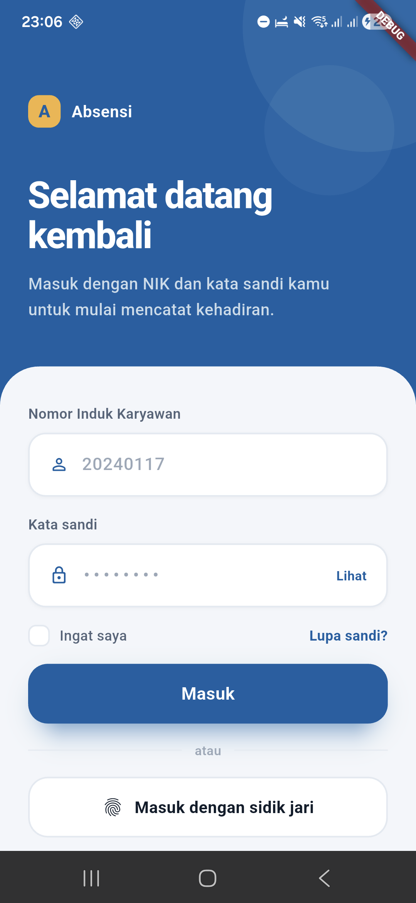
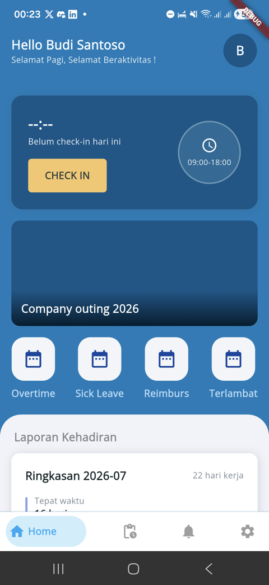
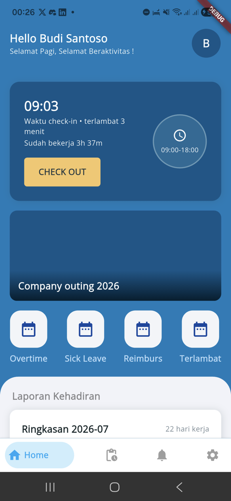
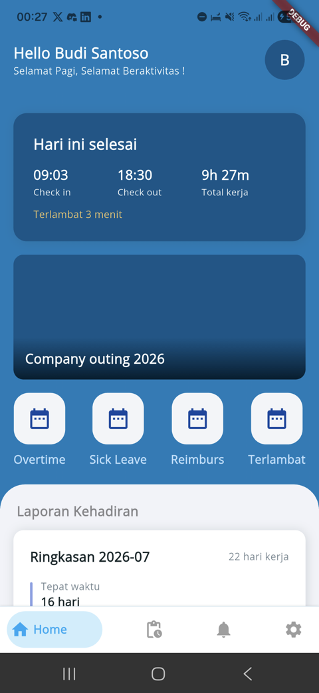
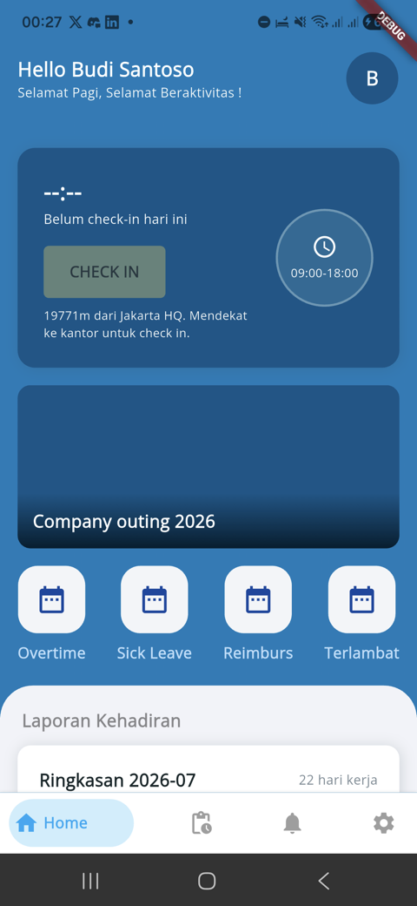
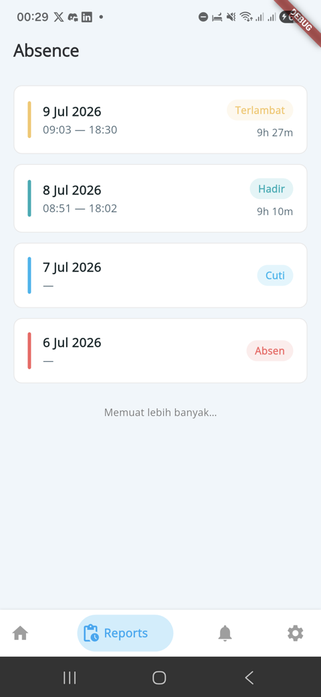
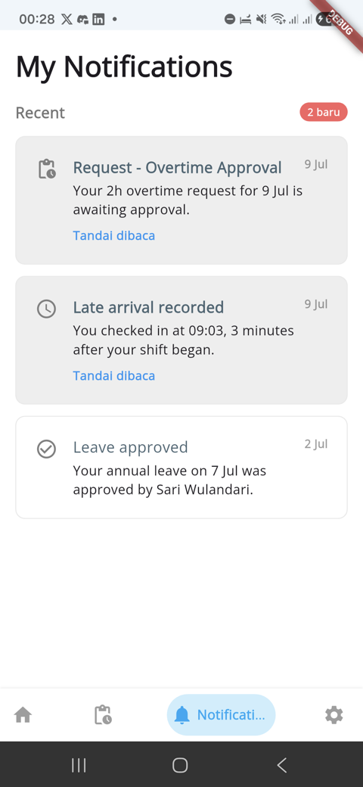
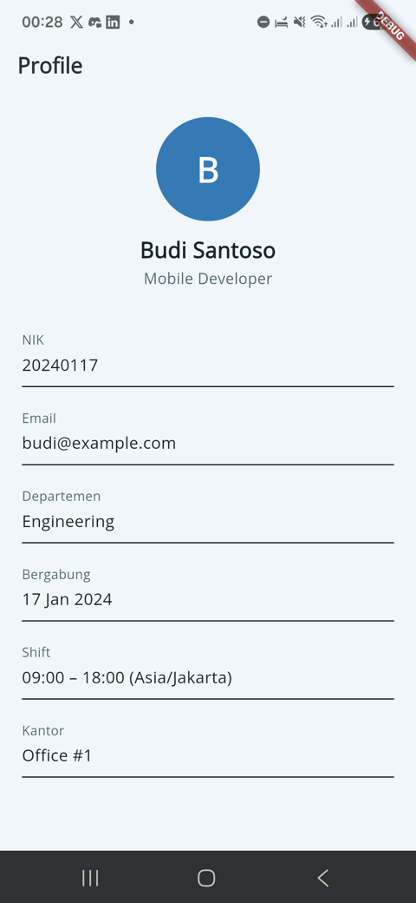
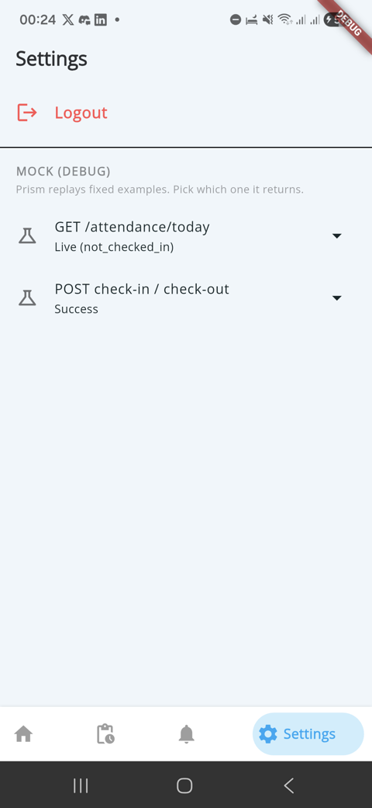

# 🕒 Attendance App

A Flutter attendance client built against a shared **OpenAPI contract** and
driven end-to-end by a [Prism](https://stoplight.io/open-source/prism) mock —
no backend required. Log in, see today's attendance state, check in/out with a
GPS fix, browse paginated history, and read a monthly summary, all served from
the contract.

> The repo was forked from a travel/tour-booking app; the login flow was the
> only part kept. Everything else — the data layer, the attendance screens, the
> home carousel, the notification feed — was rebuilt against the contract.

---

## 📱 Screenshots

Captured on a physical device (Samsung Galaxy A55, Android 16) running against
the Prism mock over the LAN.

| Login | Home — check in | Checked in |
|:---:|:---:|:---:|
|  |  |  |
| **Day summary** | **Geofence (real GPS)** | **History** |
|  |  |  |
| **Notifications** | **Profile** | **Dev menu** |
|  |  |  |

The geofence shot is real: the device was ~19.8 km from the seeded Jakarta HQ,
so the check-in button greys out and shows the measured distance. The server
re-validates every punch — the local check is only a UX affordance.

---

## 🏗️ Architecture

Clean architecture with `flutter_bloc`, wired through `get_it`:

```
presentation/bloc  →  domain/usecases  →  domain/repositories (abstract)
                                              ↑
                      data/repositories (impl)  →  data/datasources  →  dio
```

- **Envelope** — every response is `{ code, success, message, data }`. A single
  generic `ApiResponse<T>` models it, and one `mapError()` turns a `DioException`
  into a typed `Failure` (401 → re-auth, 409 → conflict, 422 → validation), each
  carrying the server's `message` verbatim so it can be shown as-is.
- **Models** use `json_serializable` (`.g.dart` parts, generated by
  `build_runner`).
- **Auth** decodes the JWT locally with `jwt_decoder` to pre-empt expiry.
- **Location** via `geolocator`; both punches send `lat`/`lng`.

Endpoints wired: `/api/auth/login`, `/api/me`, `/api/attendance/{today,
check-in, check-out, history, summary}`, `/api/notifications` (+ mark read),
`/api/announcements`, `/api/office/locations`.

---

## 🚀 Running against the mock

The contract lives in a sibling repo, `../attendance-api-contract`. Serve it
with Prism, then point the app at it — no code change, the host comes from a
`--dart-define`:

```bash
# 1. Start the mock (in the contract repo)
cd ../attendance-api-contract
npx @stoplight/prism-cli mock openapi.yaml --port 4100

# 2. Run the app against it
cd -
flutter pub get
flutter run --dart-define=BASE_URL=http://localhost:4100
```

`BASE_URL` defaults to `http://localhost:4100`, which is correct for the iOS
simulator and desktop. Log in with the seed credentials
`budi@example.com` / `correct-horse-battery`.

### On a physical device

`localhost` on the phone is the phone, not your machine — pass your computer's
LAN IP instead:

```bash
flutter run --dart-define=BASE_URL=http://192.168.1.42:4100   # your Mac's IP
```

Two things are already handled for this: cleartext HTTP is enabled in the
**debug** Android manifest only (release still refuses it), and the location
permission is declared and requested at runtime.

### The dev menu (debug only)

Prism is stateless — a `check-in` won't make the next `today` return
`checked_in`. A debug-only interceptor injects Prism's `Prefer` header, and a
menu under **Settings → MOCK (DEBUG)** lets you drive the whole day — the late
check-in, the check-out summary, the `409` duplicate, the `422` geofence
rejection — from inside the running app. It renders nothing in a release build.

---

## ✅ Testing

Integration tests drive the real widget tree, real Dio, real interceptors and
real HTTP against Prism — nothing is mocked except the GPS fix. Start Prism
first, then:

```bash
flutter drive \
  --driver=test_driver/integration_test.dart \
  --target=integration_test/attendance_test.dart \
  -d <device-id> \
  --dart-define=BASE_URL=http://localhost:4100
```

| File | Covers |
|---|---|
| `login_test.dart` | Login persists both tokens |
| `attendance_test.dart` | today ×3, check-in/out, 409, 422, history, summary, 401 |
| `profile_test.dart` | `/me`, notifications, announcements, offices, 401 |
| `geofence_affordance_test.dart` | Button greys out far from HQ; stays enabled with no fix |
| `walkthrough_test.dart` | Full UI flow, captures a screenshot per step |

Verified on the iOS simulator and a physical Android device.

---

## 🧰 Dependencies

* **State**: `flutter_bloc`, `bloc`, `get_it`, `equatable`, `dartz`
* **Network**: `dio`, `json_annotation`, `jwt_decoder`, `internet_connection_checker`
* **Location**: `geolocator`, `permission_handler`
* **Persistence**: `shared_preferences`
* **UI**: `google_fonts`, `lottie`, `shimmer`, `flutter_svg`, `bottom_navy_bar`,
  `animations`, `nb_utils`, `cached_network_image`
* **Codegen / test**: `build_runner`, `json_serializable`, `integration_test`,
  `flutter_driver`, `flutter_lints`

Regenerate models after changing one:

```bash
dart run build_runner build --delete-conflicting-outputs
```

---

## 🚧 Status & known gaps

This is the client half of a contract-first build (Stage 1). Deliberately not
done yet:

- **Leave & overtime** endpoints are in the contract but not wired; the home
  screen's Overtime / Sick Leave / Reimburs / Terlambat tiles are inert.
- **Token refresh** — the refresh token is stored but rotation is Stage 2.
- **Notification pagination** is skipped (the contract returns no page metadata).
- **Dark theme** is incomplete: several pages hardcode light-mode text colors,
  so the screenshots above force light mode.

---

## 📄 License

MIT License

---

*Built by Abdurrahman Jundullah M — mobile engineer (Flutter + native Android), 8+ years, fintech/banking background.*

